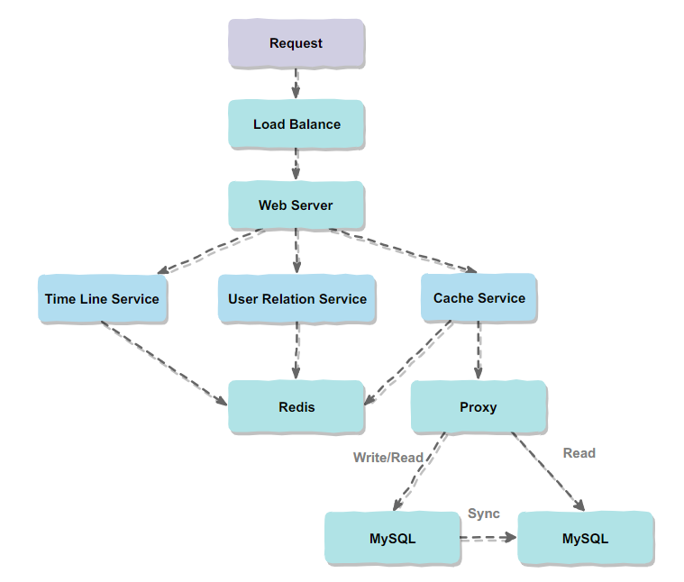
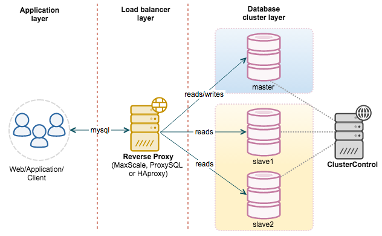
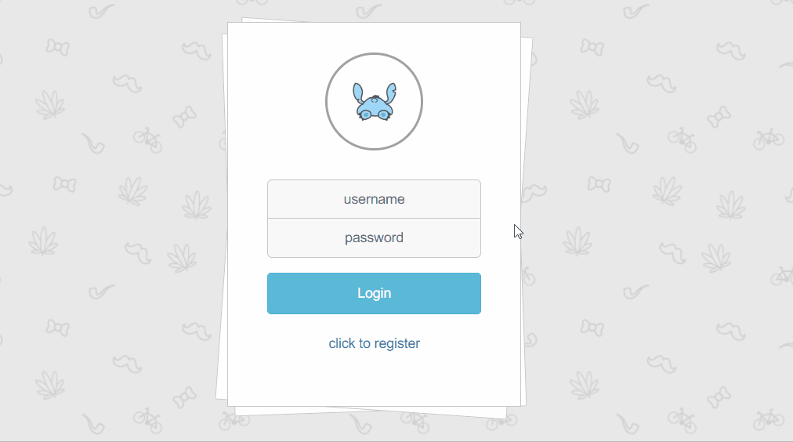

<div align="center">
    <h1>
        The design of a blog website
    </h1>
</div>

<!-- GFM-TOC -->

* System Architecture Diagram
* Software
* Performance
* Cache
    * Popular blog
    * Redis and Memcache
    * Redis configuration
    * implement
    * The compromise in bussiness
    * Choose of serialization
* Feed stream
* Security
    * XSS sefence
    * Redis Crackit
* Interaction Design
    - Asynchronously modify user avatar at login
    - Asynchronous post deletion
    <!-- GFM-TOC -->

## System Architecture Diagram

<div align="center">
  
</div>


### Software

- Linux : version 2.6.32-642.6.2.el6.x86_64
- MySQL : Ver 14.14 Distrib 5.1.73
- Redis : v=4.0.8

## Performance

Use Apache ab tool to test the pressure。

In order to defend the inference of the of the timeout of the internet, run Apache ab tool on the server side

Use the following command to use the ab tools, -c is the number of concurrency, -n is the number of requests, -k means persistent connection.

```
ab -c 1000 -n 5000 -k http://...
```

Before using Redis for caching and using the master-slave architecture to achieve read-write separation, some of the results obtained from the above tests are as follows. It can be seen that the average number of requests per second is 715.81.

```
Time taken for tests:   6.985 seconds
Total transferred:      2645529 bytes
HTML transferred:       1530306 bytes
Requests per second:    715.81 [#/sec] (mean)
```

After using Redis and the master-slave architecture, the test results are as follows, the average number of requests per second and increased to 4839.62, greatly improving the throughput of the website.

```
Time taken for tests:   1.033 seconds
Total transferred:      2696313 bytes
HTML transferred:       1559682 bytes
Requests per second:    4839.62 [#/sec] (mean)
```

## Cache implementation

### Popular blogs

The content of blog has the characteristics of reading more and writing less. In this scenario, it is particularly suitable for caching data. Redis is used to cache popular blog data.

### Redis and Memcache

At the beginning of the project, facing the choice of Redis and Memcache, the main differences between them are as follows:

- Redis has better distributed support, while Memcache can only use consistent hashing on the client to support distributed.
- Redis has two persistence features, RDB snapshot and AOF log, while Memcache has no persistence mechanism.
- Redis Value supports five types, while Memcache Value can only be String.
- Redis will swap the KV that has been useless for a long time to disk, and Memchache's data has been in memory.
- In order to completely remove the impact of disk fragmentation, Memcache divides the memory into blocks of a specific length to store data, but this method results in low memory utilization. For example, the block size is 128 bytes, and only 100 bytes of data is stored, so the remaining 28 bytes are wasted.

Considering that the project needs to use multiple cache servers, Redis is preferred. Although Spring integrates Redis, you can use Redis for caching with annotations such as @Cacheable, but in order to make the cache more controllable, I chose to implement the caching function myself.

### Redis configuration

First, Redis needs to be configured, mainly in two aspects: maximum memory usage and cache elimination strategy.

The larger the maximum memory usage is within the acceptable range of the server, the better. It is generally larger than the hotspot data, because Reids is not only used to store data, but also stores data during the operation of Redis.

Redis has five cache elimination strategies. In order to choose a strategy suitable for the project, you need to first understand each strategy.

NoEviction and TTL (Time to Live) are not suitable for the cache system of this project, because neither elimination nor elimination according to the expiration time can guarantee that the data remaining in the cache is as hot data as possible. Random is also related to expiration time, and randomization strategies cannot guarantee hotspot data. The LRU (least recently used) strategy eliminates the least recently used data. The most recently used data is considered to be hot data. Therefore, after the least recently used data is eliminated, the data in the cache can be largely guaranteed. All are popular data.

|      Method       |                         Description                        |
| :-------------: | :--------------------------------------------------: |
|  volatile-lru   | Select the least recently used data from the data set with the expiration time set to be eliminated |
|  volatile-ttl   |   Select the data that is about to expire from the data set that has been set to expire   |
| volatile-random |      Choose data elimination from the data set with the expiration time set      |
|   allkeys-lru   |       Select the least recently used data from all data sets to eliminate       |
| allkeys-random  |          Randomly select data from all data sets for elimination          |
|   noeviction    |                     Ban eviction data                     |

In addition to being used as a cache elimination strategy in Redis, LRU is used in many occasions. For example, the page replacement algorithm of the operating system can use LRU, because the page replacement algorithm is also equivalent to a cache elimination algorithm. The LinkedHashMap in Java can save LRUs inserted with key-value pairs. In Java programs, LinkedHashMap can be used to achieve a similar cache elimination function.

Realizing LRU is actually very simple, that is, maintaining the order through a linked list. When an element is accessed, the element is moved to the head of the linked list. Then the element at the tail of the linked list is the least recently used element, which can be eliminated.

### Implement

In order to realize the caching function, the implementation code of acquiring blog and adding Weibo needs to be modified.

In the code for getting Weibo, first get it from Redis, and if it fails, get it from the database.

Among them, BlogCacheDao implements the function of acquiring and adding cache. CacheHitDao is used to record the number of cache hits and misses. This is to monitor the system to optimize the cache, and can find cache penetration and cache avalanche problems .

When adding blogs to the database, it must also be added to Redis. This is because the database uses a master-slave architecture to achieve read and write separation. The master-slave synchronization process requires a certain amount of time. Inconsistent. If the read request is sent to the secondary database, then the latest data cannot be read. If the data is added to the cache while writing, the request to read the latest data will not be sent to the slave server, thereby avoiding inconsistencies between the master and standby servers during synchronization.

```java
@Override
public Blog getBlogByBlogId(int blogId)
{
    Blog blog = blogCacheDao.getBlog(blogId);
    if (blog != null) {
        cacheHitDao.hit();           /* 缓存命中 */
    } else {
        blog = blogMapper.selectByPrimaryKey(blogId);
        cacheHitDao.miss();          /* 缓存未命中 */
        blogCacheDao.addBlog(blog);  /* 放入缓存 */
    }
    return blog;
}

@Override
public void addBlog(int userId, String content)
{
    Blog blog = new Blog();
    blog.setUserid(userId);
    blog.setContent(content);
    blog.setPublishtime(new Date());
    blogMapper.insert(blog);
    blogCacheDao.addBlog(blog);
}
```

### Compromise

If the content of blog cannot be modified, then the problem of cache inconsistency can be avoided, and caches at all levels can be guaranteed to be effective caches.

The content of blog is often very simple. If you find something wrong after publishing, the cost of reposting it will not be very high. And the content of blog is often time-sensitive, that is, people will only read the recent Weibo, so a user who wants to modify the content of blog a long time ago does not make much sense, because few people can see it.

This project makes a trade-off in business and does not provide the function of modifying Weibo, which can greatly improve the performance of the system.

It can be found from this that sometimes difficult technical problems that cannot be overcome can be easily solved by simply adjusting the business.

### Choice of serialization

When implementing the Redis cache function, I first chose to use Java's own serialization method to convert an object into a byte array and then store it, but later realized that many of the content obtained by this serialization is class-defined content, this part of the content There is no need to store in the cache at all, only a few key fields need to be spliced into a string storage, the implementation code is as follows:

```java
    public static String writeBlogObject(Blog blog)
    {
        StringBuilder s = new StringBuilder();
        s.append(blog.getUserid()).append(separator);
        s.append(blog.getBlogid()).append(separator);
        s.append(DateUtil.formatDate(blog.getPublishtime())).append(separator);
        s.append(blog.getContent());
        return s.toString();
    }

    public static Blog readBlogObject(String s)
    {
        Blog blog = new Blog();
        String[] token = s.split(separator);
        blog.setUserid(Integer.valueOf(token[0]));
        blog.setBlogid(Integer.valueOf(token[1]));
        blog.setPublishtime(DateUtil.parseDate(token[2]));
        if(token.length > 3) {
            blog.setContent(token[3]);
        }
        return blog;
    }
```

In order to verify the time and space overhead of the two serialization methods, two benchmark tests were conducted. The test code is in com.cyc.benchmark.SerializeTest.java, because the longer code is not posted.

First simulate a blog object, store a certain amount of Weibo content, and then use the serialization and splicing methods that come with Java to run serialization and deserialization 1,000,000 times, respectively, to count the number of bytes and total time required for storage ,as follows:

|                | Java 序列化 | 字段拼接 |
| :------------: | :---------: | :------: |
| 存储所需字节数 |     298     |    48    |
|   运行时间/s   |   14.301    |  4.113   |

It can be found that the serialization method implemented by the field stitching method is much better than the serialization method that comes with Java, both in space and time, so the project uses its own field stitching method.

As for the JSON serialization method, because it also stores the name of the field, it is easy to know that the space overhead is much higher than the field splicing method.

## Feed Stream

Use Redis's ZSET data structure to maintain a set of published microblog IDs S1 for each user, with a score of timestamp. When the collection size exceeds a certain threshold, the oldest data is deleted.

Similarly, ZSET is used to maintain a set of microblog IDs S2 for each user, and the pull mode is used to maintain S2. After the user refreshes the homepage, they will actively pull data from their followers S1. The specific pulling process is to first take the latest timestamp t in S2, traverse all S1 of the users concerned, take out the data with a score from t to infinity, and add it to S2. When the size of S2 exceeds a certain threshold, the oldest data needs to be deleted.


When a user focuses on a new user, the user's S1 needs to be merged into the user's S2. Similarly, when a user unfollows a user, it is necessary to traverse S2 and remove the S1 content of the following user.


### Read-write separation



The master server is used to handle write operations and the latest read requests, while the slave server is used to handle read operations.

The read-write separation is usually implemented by a proxy method. The proxy server receives the read-write request from the application layer, and then decides which server to forward to.

The reasons why MySQL read-write separation can improve performance are:

- The master and slave servers are responsible for their respective reads and writes, which greatly eases lock contention;
- The slave server can be configured with MyISAM engine to improve query performance and save system overhead;
- Increase redundancy and improve availability.


#### Create a copy account

Create an account for replication on both the master and slave servers, and the account must be authorized on both master-host and slave-host, which means that the following commands need to be executed once on the master and slave servers.

```
mysql > grant all privileges on *.* to repl@'master-host' identified by 'password';
mysql > grant all privileges on *.* to repl@'slave-host' identified by 'password';
mysql > flush privileges;
```

After completion, it is best to test whether the master-slave server can be connected.

```
mysql -u repl -h host -p
```

#### configure my.cnf 

Master server

```
[root]# vi /etc/my.cnf

[mysqld]
log-bin  = mysql-bin
server-id = 10
```

Slave server

```
[root]# vi /etc/my.cnf

[mysqld]
log-bin          = mysql-bin
server-id        = 11
relay-log        = /var/lib/mysql/mysql-relay-bin
log-slave-updates = 1
read-only         = 1
```

Restart MySQL

```
[root]# service mysqld restart;
```


#### Start Replication

First check the binary file name of the main server:

```
mysql > show master status;
```

```
+------------------+----------+--------------+------------------+
| File            | Position | Binlog_Do_DB | Binlog_Ignore_DB |
+------------------+----------+--------------+------------------+
| mysql-bin.000002 |      106 |              |                  |
+------------------+----------+--------------+------------------+
```

Then configure the slave server:

```
mysql > change master to master_host='master-host',            > master_user='repl',
      > master_password='password',
      > master_log_file='mysql-bin.000002',
      > master_log_pos=0;
```

Start replication from the server:

```
mysql > start slave
```

View the replication status. Slave_IO_Running and Slave_SQL_Running must be both Yes to indicate success.

```
mysql > show slave status\G;
*************************** 1. row ***************************
              Slave_IO_State: Waiting for master to send event
                  Master_Host:
                  Master_User: repl
                  Master_Port: 3306
                Connect_Retry: 60
              Master_Log_File: mysql-bin.000002
          Read_Master_Log_Pos: 106
              Relay_Log_File: mysql-relay-bin.000006
                Relay_Log_Pos: 251
        Relay_Master_Log_File: mysql-bin.000002
            Slave_IO_Running: Yes
            Slave_SQL_Running: Yes
            ...
```

## Security

### XSS Defence

If a content site such as blog does not process the published content, it is easily affected by XSS attacks. For example, any user can post the following:

```html
<script> alert("hello"); </script>	
```

This script will be executed, causing other users to pop up a window when browsing to the content, affecting the user experience.

It is also easy to defend against XSS, as long as you escape characters such as `<` and `>`.

### Redis Crackit

When using the root user to run Redis, and Redis has not set a password or set as the initial password, then the attacker can easily log in to Redis, and use the config command to modify the authorized_keys file, so that the attacker can log in without a username and password.

The solution is to use a normal user to run Redis and set a complex Redis password.

## Interactive Design

### Asynchronously modify user avatar at login

In order to improve the user's experience when logging in, by listening to the focusout event of the user name input box, when this event occurs, the user's avatar is obtained asynchronously through ajax.
```js
var userNameInput = $("input[name=userName]");
userNameInput.focusout(function ()
{
    $.ajax({
            url: "getUserHeadPic.html",
            type: "post",
            dataType: "text",
            data: {
                userName: userNameInput.val()
            },
            success: function (headpic)
            {
                replaceHeadPic(headpic);
            }
    });
}
```

<div align="center">
    
</div>

### Asynchronous post deletion

Considering that the user wants to continue browsing the remaining posts after deleting the post, the post is deleted in an asynchronous manner, and there is no need to refresh the page after deleting the post.

After deleting the post successfully, the post will be hidden. For a better experience, the hiding process sets a delay of 200 milliseconds, which has a short hiding animation effect.

```js
var deleteBlog = $("#delete-blog");

deleteBlog.on("click", function ()
{
    var blogid = deleteBlog.attr("blogid");
    var blogDiv = $("#blog-" + blogid.toString());
    $.ajax({
        url: "editBlog.html",
        type: "post",
        dataType: "text",
        data: {
            blogId: blogid
        },
        success: function ()
        {
            blogDiv.hide(200);
        }
    });
})
```


<div align="center">
    
</div>


